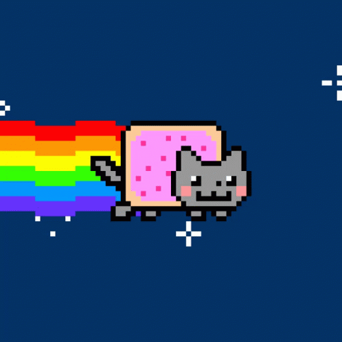

  <!-- HEADER WAVE BANNER -->
  

  <!-- DYNAMIC TYPING SVG & GREETING -->
  <h3>
    Xin chào! Mình là Tuấn Hòa 
    
  </h3>

  

    

  <!-- AESTHETIC VIBE PLAYER -->
  <kbd>🎧 <b>VIBE TODAY:</b> <i>"Midnight Starlight" (Lo-fi Chill Beats)</i> &nbsp;•&nbsp; 02:45 / 04:20 &nbsp;•&nbsp; 🔁 🔊</kbd>

 

---

### 🌌 ✧ Về mình • About Me

<table>
  <tr>
    <td width="58%" valign="top">
       
      

         <b>Tên gọi:</b> Tuấn Hòa (Anh Tuấn) 
         <b>Tọa độ:</b> Hà Tĩnh, Việt Nam 🇻🇳 
         <b>Nhiên liệu:</b> Cà phê phin thơm lừng & Những đêm tĩnh lặng 🌙 
         <b>Giai điệu:</b> Lo-fi chill, tiếng mưa rơi & Anime soundtracks 🎵 
         <b>Châm ngôn:</b> <i>"Học hỏi mỗi ngày để không là bản sao của ngày hôm qua ✨"</i>
      

       
      

        🪐 <i>"Luôn tò mò, yêu cái đẹp và thích biến những ý tưởng mộng mơ thành những sản phẩm thực tế có cảm xúc."</i>
      

    </td>
    <td width="42%" align="center" valign="middle">
      
    </td>
  </tr>
</table>

 

<!-- NYAN CAT RUNNER -->

  

---

### 📊 ✧ Dấu chân số • Activity & Streaks

  
  

 

<!-- CUTE KITTEN CODING ASSISTANT -->

  
   
  🐾 <i>Bé mèo trợ lý đang chăm chú quan sát từng dòng code...</i>

 

  

---

### 💫 ✧ Góc tương tác bí mật • Easter Egg

  
<b>✨ Click vào đây để mở thông điệp gửi riêng cho bạn...</b>

   
  <blockquote>
    🪐 <i>"Vũ trụ bao la rộng lớn, nhưng mỗi chúng ta đều là một tiểu vũ trụ độc nhất vô nhị. Chúc bạn có một ngày thật tuyệt vời, luôn mỉm cười và luôn tin vào những điều kỳ diệu!"</i> ☕🌸
  </blockquote>

---

### 📬 ✧ Kết nối với mình • Connect With Me

  
  &nbsp;
  
  &nbsp;
  
  &nbsp;
  

 

  <!-- FOOTER WAVE BANNER -->
  

