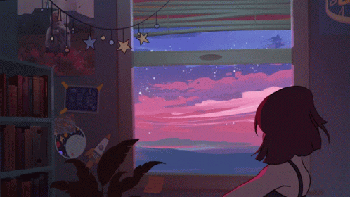
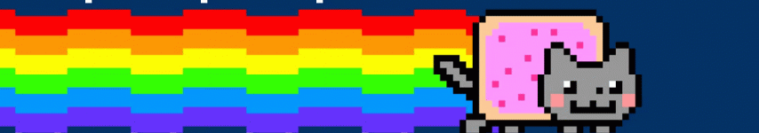
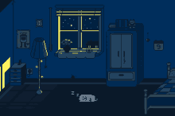
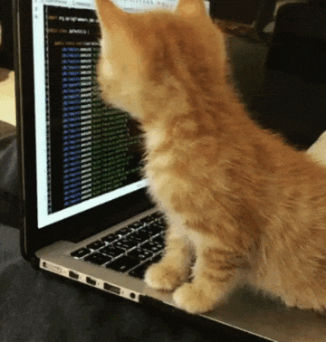
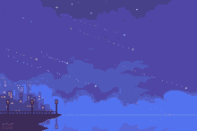
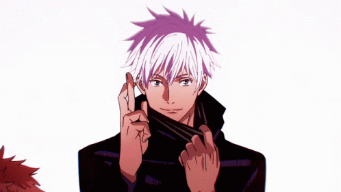
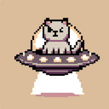

  <!-- 1. HEADER NATIVE SVG BANNER (Milky Way, Saturn, Crescent Moon, Shooting Stars, Neon Typography) -->
  

  <!-- GREETING & DYNAMIC TYPING -->
  <h2>
    Xin chào! Mình là Tuấn Hòa 
    
  </h2>

  <!-- DYNAMIC TYPING SVG: Cosmic & Lofi messages -->
  

    

  <!-- RETRO LOFI MUSIC PLAYER BADGE -->
  <kbd>🎧 <b>LOFI CHILL STATION:</b> <i>"Lofi Hip Hop • Beats to Relax / Study to"</i> &nbsp;•&nbsp; 03:24 / 04:20 &nbsp;•&nbsp; 🔁 🔊 ☕</kbd>

 

---

### 🌌 ✧ Khởi Hành • The Cosmic Odyssey &amp; About Me

<table border="0" width="100%">
  <tr>
    <td width="55%" valign="top">
       
      

         <b>Tên gọi:</b> Tuấn Hòa ✨ 
         <b>Nhiên liệu:</b> Tách cà phê ấm &amp; những đêm tĩnh lặng ngắm sao ☕🌙 
         <b>Giai điệu:</b> Lofi chillhop, tiếng mưa đêm &amp; anime soundtracks 🎵 
         <b>Cảm hứng:</b> Dải Ngân Hà lấp lánh, sự tối giản &amp; nghệ thuật thẩm mỹ ✨
      

       
      <blockquote>
        🪐 <i>"Mỗi dòng code như một hạt bụi sao trong vũ trụ số — gom nhặt từng chút một để tạo nên những dải ngân hà rực rỡ và có cảm xúc."</i>
      </blockquote>
    </td>
    <td width="45%" align="center" valign="middle">
      
       
      🌌 <i>Khung cửa sổ ngắm dải mây hoàng hôn ngân hà huyền ảo</i>
    </td>
  </tr>
</table>

 

<!-- NYAN CAT COSMIC RAINBOW RUNNER (FULL WIDTH TRANSITION) -->

  

 

---

### ☕ ✧ Khung Cảnh Chill Lofi • Cozy Night Corners

<table border="0" width="100%">
  <tr>
    <td width="50%" align="center" valign="top">
      <h4>☕ Ban Công Đêm Lãng Mạn</h4>
      
       
      

        🌃 <i>Đeo tai nghe bên ban công lộng gió, ngắm ánh đèn thành phố và vì sao đêm cùng bé mèo cưng...</i>
      

    </td>
    <td width="50%" align="center" valign="top">
      <h4>🌙 Phòng Ngủ Lofi Bình Yên</h4>
      
       
      

        🕯️ <i>Ánh đèn ngủ ấm áp, chú mèo nhỏ cuộn tròn ngủ ngoan, tiếng nhạc lofi vỗ về giấc ngủ sau một ngày dài...</i>
      

    </td>
  </tr>
</table>

 

---

### 🐾 ✧ Đồng Hành &amp; Bầu Trời Sao Băng • Companion &amp; Shooting Stars

<table border="0" width="100%">
  <tr>
    <td width="48%" align="center" valign="top">
      <h4>🐾 Bé Mèo Trợ Lý Code</h4>
      
       
      

        💻 <i>Trợ lý 4 chân lông xù luôn chăm chú quan sát, hỗ trợ Tuấn Hòa gõ từng phím code không biết mệt mỏi!</i>
      

    </td>
    <td width="52%" align="center" valign="top">
      <h4>🌠 Bến Cảng Sao Băng Lofi</h4>
      
       
      

        ✨ <i>"Mỗi ngôi sao băng vụt sáng trên bầu trời là một lời chúc may mắn gửi tới những ai hữu duyên nhìn thấy."</i>
      

    </td>
  </tr>
</table>

 

---

### ⚡ ✧ Lãnh Địa Vô Hạn • Domain Expansion: Infinite Void 🌌

<table border="0" width="100%">
  <tr>
    <td width="55%" align="center" valign="middle">
      
    </td>
    <td width="45%" valign="top">
       
      <h4>🤞 領域展開 • Vô Lượng Không Xử (無量空処)</h4>
      <blockquote>
        🪐 <i>"Trong thế giới số, thông tin là vô tận. Nhưng giữa dòng chảy của code và vũ trụ, chỉ có sự tĩnh lặng, sáng tạo và đam mê là mãi mãi."</i>
      </blockquote>
      

        ⚡ <b>Trạng thái:</b> <i>Vô Hạ Hạn (Infinity Active)</i> ♾️ 
        👁️ <b>Thị lực:</b> <i>Lục Nhãn (Six Eyes) nhìn thấu vạn vật</i> 🔮 
        🌌 <b>Cảnh giới:</b> <i>Vũ trụ vô cực &amp; Dải Ngân Hà sâu thẳm</i> ✨
      

    </td>
  </tr>
</table>

 

---

### 📊 ✧ Dấu Chân Số • Activity &amp; Streaks

  
  

 

  

 

---

### 💫 ✧ Góc Tương Tác Bí Mật • Cosmic Message

  
<b>✨ Click vào đây để mở thông điệp gửi riêng cho bạn từ vũ trụ...</b>

   
  <blockquote>
    🪐 <i>"Vũ trụ bao la rộng lớn, nhưng mỗi chúng ta đều là một tiểu vũ trụ độc nhất vô nhị. Chúc bạn có một ngày thật nhẹ nhàng, thưởng thức trọn vẹn tách trà hay cà phê ấm, và luôn giữ nụ cười trên môi!"</i> ☕🌸✨
  </blockquote>
  

    
     
    🛸 <i>Mèo du hành vũ trụ gửi tín hiệu chúc bạn ngày mới tràn đầy niềm vui!</i>
  

 

---

### 📬 ✧ Trạm Kết Nối • Connect

  

 

  <!-- FOOTER NATIVE SVG BANNER -->
  

